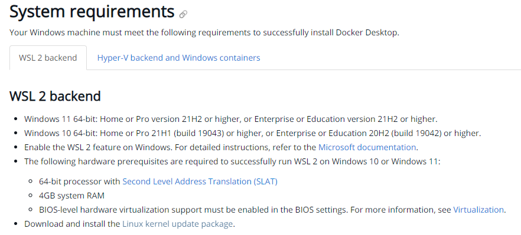
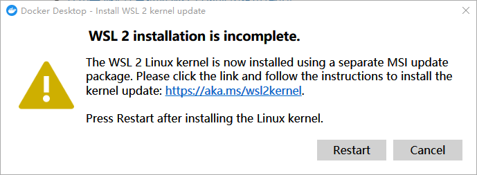
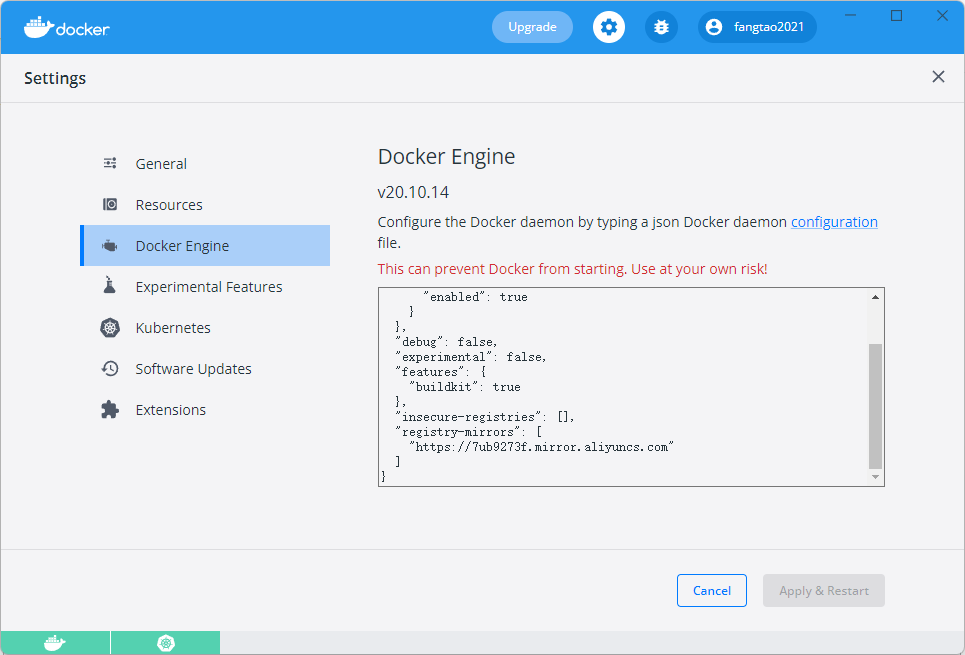

# 安装 Docker Desktop

## 1 Windows 安装 Docker

### 1.1 下载并安装 Docker

官方文档：[在 Windows | 上安装 Docker DesktopDocker 文档](https://docs.docker.com/desktop/windows/install/)

系统要求：



查看系统版本：win+r 输入winver

注意最后一行需要**安装 WSL2 Linux 内核更新包**，否则运行Docker Desktop会遇到以下错误



### 1.2 验证 Docker 是否安装成功

命令行输入：`docker version`

```
C:\Users\DELL>docker version
Client:
 Cloud integration: v1.0.24
 Version:           20.10.14
 API version:       1.41
 Go version:        go1.16.15
 Git commit:        a224086
 Built:             Thu Mar 24 01:53:11 2022
 OS/Arch:           windows/amd64
 Context:           default
 Experimental:      true
 
Server: Docker Desktop 4.8.1 (78998)
 Engine:
  Version:          20.10.14
  API version:      1.41 (minimum version 1.12)
  Go version:       go1.16.15
  Git commit:       87a90dc
  Built:            Thu Mar 24 01:46:14 2022
  OS/Arch:          linux/amd64
  Experimental:     false
 containerd:
  Version:          1.5.11
  GitCommit:        3df54a852345ae127d1fa3092b95168e4a88e2f8
 runc:
  Version:          1.0.3
  GitCommit:        v1.0.3-0-gf46b6ba
 docker-init:
  Version:          0.19.0
  GitCommit:        de40ad0
```


### 1.3 配置阿里云镜像加速

阿里云镜像加速器地址：参见：[容器镜像服务 (aliyun.com)](https://cr.console.aliyun.com/cn-hangzhou/instances/mirrors)

在 Settings --> Docker Engine 中配置镜像加速

```json
{
  "registry-mirrors": ["https://7ub9273f.mirror.aliyuncs.com"]
}
```



### 1.4 测试 hello-world

```shell
PS C:\Users\Administrator> docker run hello-world
Unable to find image 'hello-world:latest' locally
latest: Pulling from library/hello-world
2db29710123e: Pull complete
Digest: sha256:2498fce14358aa50ead0cc6c19990fc6ff866ce72aeb5546e1d59caac3d0d60f
Status: Downloaded newer image for hello-world:latest

Hello from Docker!
This message shows that your installation appears to be working correctly.

To generate this message, Docker took the following steps:
 1. The Docker client contacted the Docker daemon.
 2. The Docker daemon pulled the "hello-world" image from the Docker Hub.
    (amd64)
 3. The Docker daemon created a new container from that image which runs the
    executable that produces the output you are currently reading.
 4. The Docker daemon streamed that output to the Docker client, which sent it
    to your terminal.

To try something more ambitious, you can run an Ubuntu container with:
 $ docker run -it ubuntu bash

Share images, automate workflows, and more with a free Docker ID:
 https://hub.docker.com/

For more examples and ideas, visit:
 https://docs.docker.com/get-started/
```

