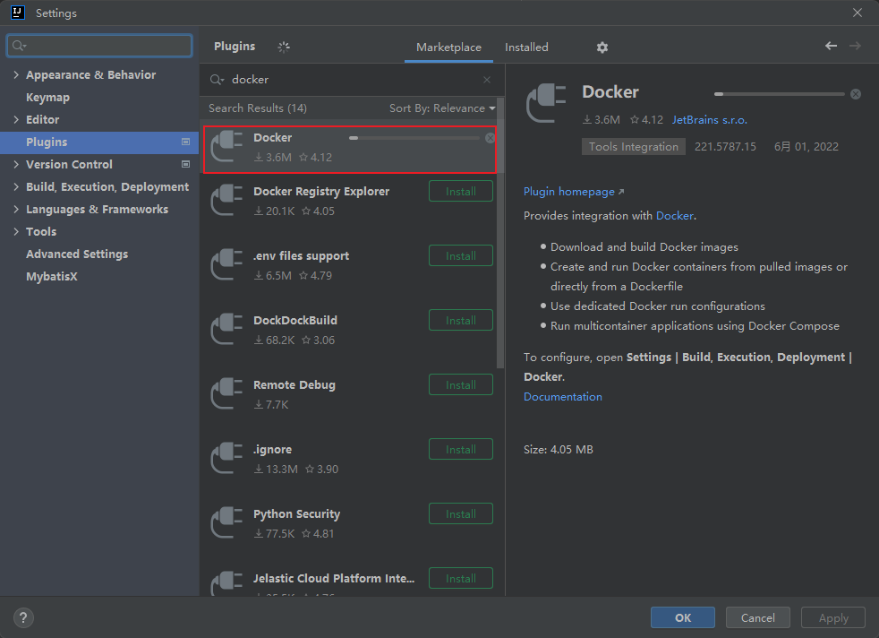
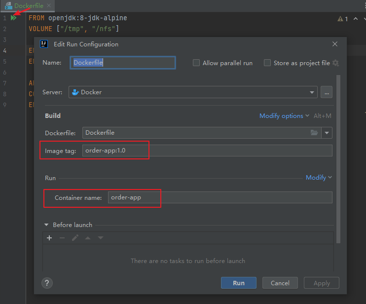
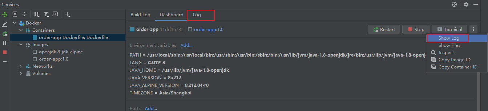
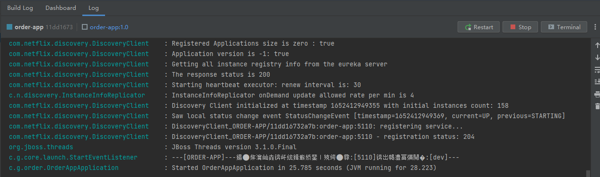
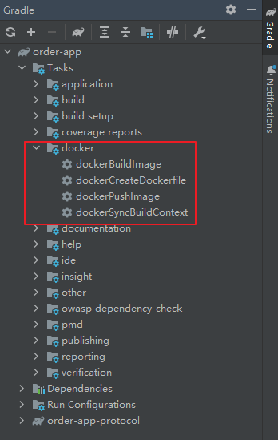

# Docker部署SpringBoot项目

## 1 Dockerfile

todo...

## 2 Idea 使用 Docker 插件

### 2.1 安装插件

企业版 idea 最新版本默认已经安装了 Docker，如果没有的，同学们自行下载安装。



### 2.2 连接 Docker


此时我们就可以在 idea 中管理 docker 啦

## 3 在Docker中部署Spring Boot应用

本地开发过程中，我们可以选择手动编写 Dockerfile，生成镜像；也可以通过 Gradle 插件，帮我们自动执行。

### 3.1：编写Dockfile

首先build，生成jar包

```groovy
.\gradlew clean build
```

项目根目录下新建 Dockerfile 文件，官方推荐文件名称就叫 Dockerfile，算是一种约定，安装 Docker 插件后，会有关键字提示。

```
FROM openjdk:8-jdk-alpine
VOLUME ["/tmp", "/nfs"]
 
ENV LANG C.UTF-8
ENV TIMEZONE Asia/Shanghai
 
ARG JAR_FILE=build/libs/*.jar
COPY ${JAR_FILE} app.jar
ENTRYPOINT ["sh", "-c", "java ${JAVA_OPTS} -jar /app.jar ${0} ${@}"]
```



点击run，可以看到他会为我们自动构建image，并运行容器

```
Deploying 'order-app Dockerfile: Dockerfile'…
Building image…
Preparing build context archive…
[==================================================>]3938/3938 files
Done
 
Sending build context to Docker daemon…
[==================================================>] 210.2MB
Done
 
Step 1/7 : FROM openjdk:8-jdk-alpine
 ---> a3562aa0b991
Step 2/7 : VOLUME ["/tmp", "/nfs"]
 ---> Running in c8279f5a3858
Removing intermediate container c8279f5a3858
 ---> b8e7893624d6
Step 3/7 : ENV LANG C.UTF-8
 ---> Running in ae5b7ae96591
Removing intermediate container ae5b7ae96591
 ---> 4a98f6269e05
Step 4/7 : ENV TIMEZONE Asia/Shanghai
 ---> Running in 5d7d95c9e07f
Removing intermediate container 5d7d95c9e07f
 ---> 123c3a57d845
Step 5/7 : ARG JAR_FILE=build/libs/*.jar
 ---> Running in adbc039bb2f0
Removing intermediate container adbc039bb2f0
 ---> e5e9ef998df0
Step 6/7 : COPY ${JAR_FILE} app.jar
 ---> 1e5333a4646a
Step 7/7 : ENTRYPOINT ["sh", "-c", "java ${JAVA_OPTS} -jar /app.jar ${0} ${@}"]
 ---> Running in 822d316d2bea
Removing intermediate container 822d316d2bea
 ---> cbf3df2c9b35
 
Successfully built cbf3df2c9b35
Successfully tagged order-app:1.0
Creating container…
Container Id: 11dd16732a7b9f056988f0a28acee5181239f52687a68b8887a654fb654da85c
Container name: 'order-app'
Starting container 'order-app'
'order-app Dockerfile: Dockerfile' has been deployed successfully.
```


查看日志，默认情况下是没有展示log 这个tab，在Dashboard下，选择 show log，可以看到已经启动成功。







### 3.2：Gradle 插件

参考文档：[Gradle Docker Plugin User Guide & Examples (bmuschko.github.io)](https://bmuschko.github.io/gradle-docker-plugin/)

该插件可以为我们一键生成 Dockerfile、build 并生成镜像。

```groovy
plugins {
    id 'com.bmuschko.docker-spring-boot-application' version '6.7.0'
}
docker {
    springBootApplication {
        baseImage = 'openjdk:8-jdk-alpine'
        maintainer = 'fangtao'
        images = ['order-app:1.2']
        jvmArgs = ["-Duser.timezone=Asia/Shanghai"]
    }
}
```



## 思考点

1. 如何接入k8s环境，是否可以本地启动容器接入
2. web 项目，当前是通过 nginx 配置代理到开发机器，容器化后，如何访问
3. 本地联调，feign 调用app项目，如何指定节点或 ip