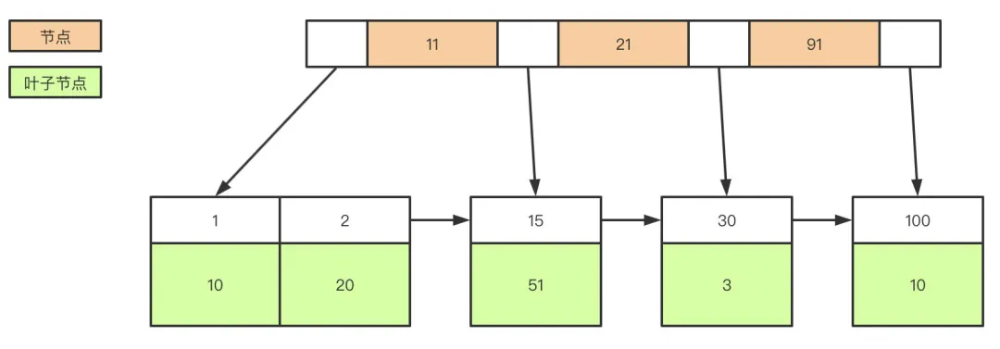

# Java 面试题整理

## MySQL

### 1. myisam 和 innodb的区别吗？

myisam引擎是5.1版本之前的默认引擎，支持全文检索、压缩、空间函数等，但是不支持事务和行级锁，所以一般用于有大量查询少量插入的场景来使用，而且myisam不支持外键，并且索引和数据是分开存储的。

innodb是基于聚簇索引建立的，和myisam相反它支持事务、外键，并且通过MVCC来支持高并发，索引和数据存储在一起。

### 2. 说下mysql的索引有哪些吧，聚簇和非聚簇索引又是什么？

索引按照数据结构来说主要包含B+树和Hash索引。

假设我们有张表，结构如下：

```
create table user(
 id int(11) not null,
  age int(11) not null,
  primary key(id),
  key(age)
);
```

B+树是左小右大的顺序存储结构，节点只包含id索引列，而叶子节点包含索引列和数据，这种数据和索引在一起存储的索引方式叫做聚簇索引，一张表只能有一个聚簇索引。假设没有定义主键，InnoDB会选择一个唯一的非空索引代替，如果没有的话则会隐式定义一个主键作为聚簇索引。


这是主键聚簇索引存储的结构，那么非聚簇索引的结构是什么样子呢？非聚簇索引(二级索引)保存的是主键id值，这一点和myisam保存的是数据地址是不同的。


最终，我们一张图看看InnoDB和Myisam聚簇和非聚簇索引的区别


### 3. 那你知道什么是覆盖索引和回表吗？

覆盖索引指的是在一次查询中，如果一个索引包含或者说覆盖所有需要查询的字段的值，我们就称之为覆盖索引，而不再需要回表查询。

而要确定一个查询是否是覆盖索引，我们只需要explain sql语句看Extra的结果是否是“Using index”即可。

以上面的user表来举例，我们再增加一个name字段，然后做一些查询试试。

```
explain select * from user where age=1; //查询的name无法从索引数据获取
explain select id,age from user where age=1; //可以直接从索引获取
```

### 4. 锁的类型有哪些呢

mysql锁分为**共享锁**和**排他锁**，也叫做读锁和写锁。

读锁是共享的，可以通过lock in share mode实现，这时候只能读不能写。

写锁是排他的，它会阻塞其他的写锁和读锁。从颗粒度来区分，可以分为**表锁**和**行锁**两种。

表锁会锁定整张表并且阻塞其他用户对该表的所有读写操作，比如alter修改表结构的时候会锁表。

行锁又可以分为**乐观锁**和**悲观锁**，悲观锁可以通过for update实现，乐观锁则通过版本号实现。

### 5. 你能说下事务的基本特性和隔离级别吗？

事务基本特性ACID分别是：

**原子性** 指的是一个事务中的操作要么全部成功，要么全部失败。

**一致性** 指的是数据库总是从一个一致性的状态转换到另外一个一致性的状态。比如A转账给B100块钱，假设中间sql执行过程中系统崩溃A也不会损失100块，因为事务没有提交，修改也就不会保存到数据库。

**隔离性** 指的是一个事务的修改在最终提交前，对其他事务是不可见的。

**持久性** 指的是一旦事务提交，所做的修改就会永久保存到数据库中。

而隔离性有4个隔离级别，分别是：

**read uncommit** 读未提交，可能会读到其他事务未提交的数据，也叫做脏读。

用户本来应该读取到id=1的用户age应该是10，结果读取到了其他事务还没有提交的事务，结果读取结果age=20，这就是脏读。


**read commit** 读已提交，两次读取结果不一致，叫做不可重复读。

不可重复读解决了脏读的问题，他只会读取已经提交的事务。

用户开启事务读取id=1用户，查询到age=10，再次读取发现结果=20，在同一个事务里同一个查询读取到不同的结果叫做不可重复读。


**repeatable read** 可重复复读，这是mysql的默认级别，就是每次读取结果都一样，但是有可能产生幻读。

**serializable** 串行，一般是不会使用的，他会给每一行读取的数据加锁，会导致大量超时和锁竞争的问题。

### 6. 那ACID靠什么保证的呢？

A原子性由undo log日志保证，它记录了需要回滚的日志信息，事务回滚时撤销已经执行成功的sql

C一致性一般由代码层面来保证

I隔离性由MVCC来保证

D持久性由内存+redo log来保证，mysql修改数据同时在内存和redo log记录这次操作，事务提交的时候通过redo log刷盘，宕机的时候可以从redo log恢复

### 7. 那你说说什么是幻读，什么是MVCC？

要说幻读，首先要了解MVCC，MVCC叫做多版本并发控制，实际上就是保存了数据在某个时间节点的快照。

我们每行数实际上隐藏了两列，创建时间版本号，过期(删除)时间版本号，每开始一个新的事务，版本号都会自动递增。

还是拿上面的user表举例子，假设我们插入两条数据，他们实际上应该长这样。

| id   | name | create_version | delete_version |
| ---- | ---- | -------------- | -------------- |
| 1    | 张三 | 1              |                |
| 2    | 李四 | 2              |                |

这时候假设小明去执行查询，此时current_version=3

```
select * from user where id<=3;
```

同时，小红在这时候开启事务去修改id=1的记录，current_version=4

```
update user set name='张三三' where id=1;
```

执行成功后的结果是这样的

| id   | name   | create_version | delete_version |
| ---- | ------ | -------------- | -------------- |
| 1    | 张三   | 1              |                |
| 2    | 李四   | 2              |                |
| 1    | 张三三 | 4              |                |

如果这时候还有小黑在删除id=2的数据，current_version=5，执行后结果是这样的。

| id   | name   | create_version | delete_version |
| ---- | ------ | -------------- | -------------- |
| 1    | 张三   | 1              |                |
| 2    | 李四   | 2              | 5              |
| 1    | 张三三 | 4              |                |

由于MVCC的原理是查找创建版本小于或等于当前事务版本，删除版本为空或者大于当前事务版本，小明的真实的查询应该是这样

```
select * from user where id<=3 and create_version<=3 and (delete_version>3 or delete_version is null);
```

所以小明最后查询到的id=1的名字还是'张三'，并且id=2的记录也能查询到。这样做是**为了保证事务读取的数据是在事务开始前就已经存在的，要么是事务自己插入或者修改的**。

明白MVCC原理，我们来说什么是幻读就简单多了。举一个常见的场景，用户注册时，我们先查询用户名是否存在，不存在就插入，假定用户名是唯一索引。

1. 小明开启事务current_version=6查询名字为'王五'的记录，发现不存在。
2. 小红开启事务current_version=7插入一条数据，结果是这样：

| id   | Name | create_version | delete_version |
| ---- | ---- | -------------- | -------------- |
| 1    | 张三 | 1              |                |
| 2    | 李四 | 2              |                |
| 3    | 王五 | 7              |                |

1. 小明执行插入名字'王五'的记录，发现唯一索引冲突，无法插入，这就是幻读。

### 8. 那你知道什么是间隙锁吗？

间隙锁是可重复读级别下才会有的锁，结合MVCC和间隙锁可以解决幻读的问题。我们还是以user举例，假设现在user表有几条记录

| id   | Age  |
| ---- | ---- |
| 1    | 10   |
| 2    | 20   |
| 3    | 30   |

当我们执行：

```
begin;
select * from user where age=20 for update;

begin;
insert into user(age) values(10); #成功
insert into user(age) values(11); #失败
insert into user(age) values(20); #失败
insert into user(age) values(21); #失败
insert into user(age) values(30); #失败
```

只有10可以插入成功，那么因为表的间隙mysql自动帮我们生成了区间(左开右闭)

```
(negative infinity，10],(10,20],(20,30],(30,positive infinity)
```

由于20存在记录，所以(10,20]，(20,30]区间都被锁定了无法插入、删除。

如果查询21呢？就会根据21定位到(20,30)的区间(都是开区间)。

需要注意的是唯一索引是不会有间隙索引的。

### 9. 你们数据量级多大？分库分表怎么做的？

首先分库分表分为垂直和水平两个方式，一般来说我们拆分的顺序是先垂直后水平。

**垂直分库**

基于现在微服务拆分来说，都是已经做到了垂直分库了


**垂直分表**

如果表字段比较多，将不常用的、数据较大的等等做拆分


**水平分表**

首先根据业务场景来决定使用什么字段作为分表字段(sharding_key)，比如我们现在日订单1000万，我们大部分的场景来源于C端，我们可以用user_id作为sharding_key，数据查询支持到最近3个月的订单，超过3个月的做归档处理，那么3个月的数据量就是9亿，可以分1024张表，那么每张表的数据大概就在100万左右。

比如用户id为100，那我们都经过hash(100)，然后对1024取模，就可以落到对应的表上了。

### 10. 那分表后的ID怎么保证唯一性的呢？

因为我们主键默认都是自增的，那么分表之后的主键在不同表就肯定会有冲突了。有几个办法考虑：

1. 设定步长，比如1-1024张表我们设定1024的基础步长，这样主键落到不同的表就不会冲突了。
2. 分布式ID，自己实现一套分布式ID生成算法或者使用开源的比如雪花算法这种
3. 分表后不使用主键作为查询依据，而是每张表单独新增一个字段作为唯一主键使用，比如订单表订单号是唯一的，不管最终落在哪张表都基于订单号作为查询依据，更新也一样。

### 11. 分表后非sharding_key的查询怎么处理呢？

1. 可以做一个mapping表，比如这时候商家要查询订单列表怎么办呢？不带user_id查询的话你总不能扫全表吧？所以我们可以做一个映射关系表，保存商家和用户的关系，查询的时候先通过商家查询到用户列表，再通过user_id去查询。
2. 打宽表，一般而言，商户端对数据实时性要求并不是很高，比如查询订单列表，可以把订单表同步到离线（实时）数仓，或者基于其他如es提供查询服务。
3. 数据量不是很大的话，比如后台的一些查询之类的，也可以通过多线程扫表，然后再聚合结果的方式来做。或者异步的形式也是可以的。

```
List<Callable<List<User>>> taskList = Lists.newArrayList();
for (int shardingIndex = 0; shardingIndex < 1024; shardingIndex++) {
    taskList.add(() -> (userMapper.getProcessingAccountList(shardingIndex)));
}
List<ThirdAccountInfo> list = null;
try {
    list = taskExecutor.executeTask(taskList);
} catch (Exception e) {
    //do something
}

public class TaskExecutor {
    public <T> List<T> executeTask(Collection<? extends Callable<T>> tasks) throws Exception {
        List<T> result = Lists.newArrayList();
        List<Future<T>> futures = ExecutorUtil.invokeAll(tasks);
        for (Future<T> future : futures) {
            result.add(future.get());
        }
        return result;
    }
}
```

### 12. 说说mysql主从同步怎么做的吧？

首先先了解mysql主从同步的原理

1. master提交完事务后，写入binlog
2. slave连接到master，获取binlog
3. master创建dump线程，推送binglog到slave
4. slave启动一个IO线程读取同步过来的master的binlog，记录到relay log中继日志中
5. slave再开启一个sql线程读取relay log事件并在slave执行，完成同步
6. slave记录自己的binglog



由于mysql默认的复制方式是异步的，主库把日志发送给从库后不关心从库是否已经处理，这样会产生一个问题就是假设主库挂了，从库处理失败了，这时候从库升为主库后，日志就丢失了。由此产生两个概念。

**全同步复制**

主库写入binlog后强制同步日志到从库，所有的从库都执行完成后才返回给客户端，但是很显然这个方式的话性能会受到严重影响。

**半同步复制**

和全同步不同的是，半同步复制的逻辑是这样，从库写入日志成功后返回ACK确认给主库，主库收到至少一个从库的确认就认为写操作完成。

## 设计模式

## Java 基础

## MQ

## Spring

## Redis


## 初级面试题
###### 1. 面向对象的特征有哪些方面
1. 抽象：抽象就是忽略一个主体与当前目标无关的那些方面，以便更充分地注意与当前目标有关的方面。抽象并不打算了解全部问题，而只是选择其中的一部分，暂时不用部分细节。抽象包括两个方面，一是过程抽象，二是数据抽象。
2. 继承：继承是一种联结类的层次模型，并且允许和鼓励类的重用，它提供了一种明确表述共性的方法。对象的一个新类可以从现有的类中派生，这个过程称为类继承。新类继承了原始类的特性，新类称为原始类的派生类（子类），而原始类称为新类的基类（父类）。派生类可以从它的基类那里继承方法和实例变量，并且类可以修改或增加新的方法使之更适合特殊的需要。
3. 封装：封装是把过程和数据包围起来，对数据的访问只能通过已定义的界面。面向对象计算始于这个基本概念，即现实世界可以被描绘成一系列完全自治、封装的对象，这些对象通过一个受保护的接口访问其他对象。
4. 多态性：多态性是指允许不同类的对象对同一消息作出响应。多态性包括参数化多态性和包含多态性。多态性语言具有灵活、抽象、行为共享、代码共享的优势，很好的解决了应用程序函数同名问题。

###### 关键字，private protected public static final 组合着问

## 中级面试题
###### Exception和Error的区别
###### HashMap实现原理(数组+链表)，查找数据的时间复杂度

## 高级面试题
###### 垃圾回收机制。。。(主要从下面几方面解答 GC原理、最好画图解释一下年轻代（Eden区和Survival区）、年老代、比例分配及为啥要这样分代回收)
###### 对象分配问题，堆栈里的问题，
详细的会问道方法区、堆、程序计数器、本地方法栈、虚拟机栈，问题入口从String a,new String("")开始

###### Object类里面有哪几种方法，作用

```java
protected Object clone()  //创建并返回此对象的一个副本。
public boolean equals(Object obj)  //指示某个其他对象是否与此对象“相等”。
public protected void finalize()  //当垃圾回收器确定不存在对该对象的更多引用时，由对象的垃圾回收器调用此方法。
public Class<? extendsObject> getClass()  //返回一个对象的运行时类。
public int hashCode()  //返回该对象的哈希码值。
public void notify()  //唤醒在此对象监视器上等待的单个线程。
public void notifyAll()  //唤醒在此对象监视器上等待的所有线程。
public String toString()  //返回该对象的字符串表示。
public void wait()  //导致当前的线程等待，直到其他线程调用此对象的 notify() 方法或 notifyAll() 方法。
public void wait(long timeout)  //导致当前的线程等待，直到其他线程调用此对象的 notify() 方法或 notifyAll() 方法，或者超过指定的时间量。
public void wait(long timeout, int nanos)  //导致当前的线程等待，直到其他线程调用此对象的 notify() 方法或 notifyAll() 方法，或者其他某个线程中断当前线程，或者已超过某个实际时间量。
```

###### equals 和 hashCode方法，重写equals的原则()
###### 向上转型
###### Java引用类型(强引用，软引用，弱引用，虚引用)
###### 线程相关的，主要是volitate，synchorized，wait()，notify()，notifyAll()，join()
###### 反射的用途
###### List有哪些子类，各有什么区别
###### 内存泄露，举个例子
###### OOM是怎么出现的，有哪几块JVM区域会产生OOM，如何解决(对于该问题，建议去《Java特种兵》的3.6章)
###### Java里面的观察者模式实现
###### 单例实现(我一般用enum写，不容易被挑毛病)
###### 用Java模拟一个栈，并能够做到扩容，并且能有同步锁。（用数组实现）
###### Java泛型机制，泛型机制的优点，以及类型变量


###### Spring Bean的生命周期
1. 首先容器启动后，会对scope为singleton且非懒加载的bean进行实例化，
2. 按照Bean定义信息配置信息，注入所有的属性，
3. 如果Bean实现了 `BeanNameAware` 接口，会回调该接口的 `setBeanName()` 方法，传入该Bean的id，此时该Bean就获得了自己在配置文件中的id，
4. 如果Bean实现了 `BeanFactoryAware` 接口,会回调该接口的 `setBeanFactory()` 方法，传入该Bean的BeanFactory，这样该Bean就获得了自己所在的BeanFactory，
5. 如果Bean实现了 `ApplicationContextAware` 接口,会回调该接口的 `setApplicationContext()` 方法，传入该Bean的 `ApplicationContext`，这样该Bean就获得了自己所在的ApplicationContext，
6. 如果有Bean实现了BeanPostProcessor接口，则会回调该接口的postProcessBeforeInitialzation()方法，
7. 如果Bean实现了InitializingBean接口，则会回调该接口的afterPropertiesSet()方法，
8. 如果Bean配置了init-method方法，则会执行init-method配置的方法，
9. 如果有Bean实现了BeanPostProcessor接口，则会回调该接口的postProcessAfterInitialization()方法，
10. 经过流程9之后，就可以正式使用该Bean了,对于scope为singleton的Bean,Spring的ioc容器中会缓存一份该bean的实例，而对于scope为prototype的Bean,每次被调用都会new一个新的对象，期生命周期就交给调用方管理了，不再是Spring容器进行管理了
11. 容器关闭后，如果Bean实现了DisposableBean接口，则会回调该接口的destroy()方法，
12. 如果Bean配置了destroy-method方法，则会执行destroy-method配置的方法，至此，整个Bean的生命周期结束
