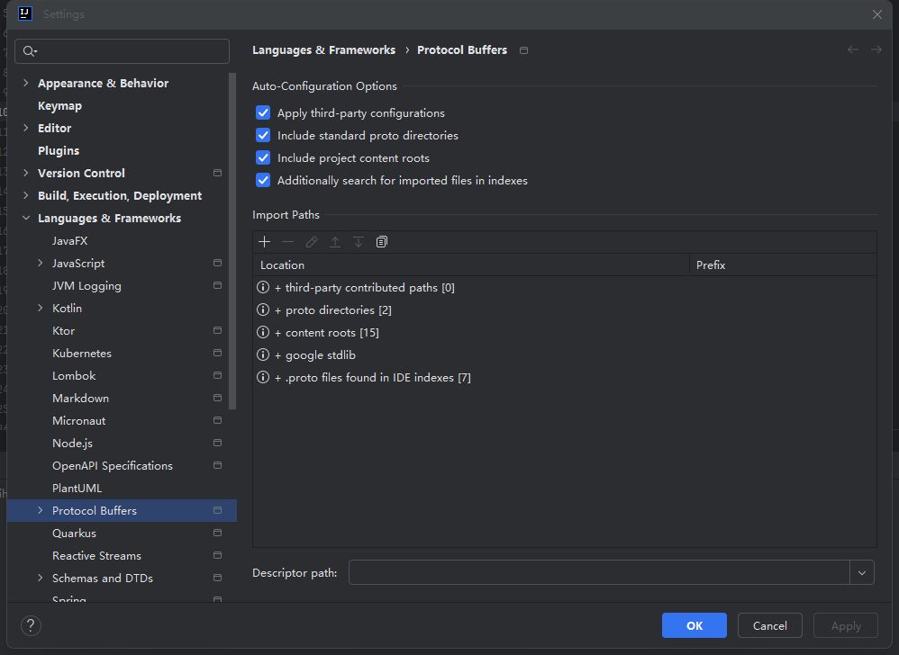
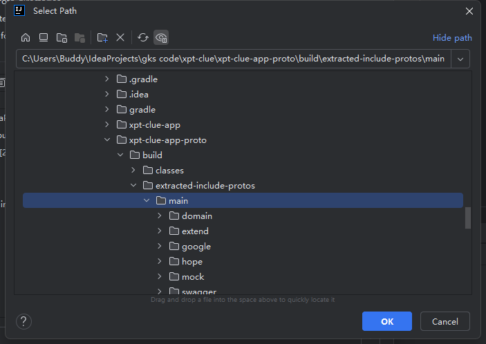

# IDEA 使用问题解决

## 中文乱码问题

1、修改 IDEA 设置

help>>Edit Custom Properties 文件末尾添加

```
-Dfile.encoding=UTF-8
```

help>>Edit Custom Properties VM Options文件末尾添加

```
-Dfile.encoding=UTF-8
```

Settings>>Editor>>File Encodeings 面板 配置 UTF-8

- Global Encoding
- Peoject Encoding
- Default encoding for properties files

重启 intellij idea 中文乱码可以解决

## IDEA 升级2024后不识别自定义proto解决方案




